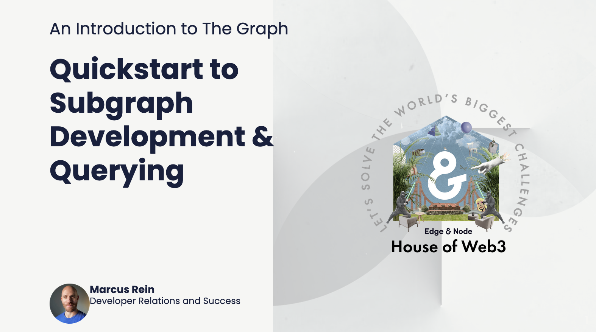

# NFT Subgraph Workshop

## Slides

[](https://docs.google.com/presentation/d/1-jZd4Sp83YW6r2KhXYeU4sOlKdcmp0LVi3WF1VAkxzk/edit?usp=sharing)

## Cheatsheet

[](./cheatsheet_Design_ETH_SF.pdf)

## Prerequisites

-   Install graph-cli: `yarn global add @graphprotocol/graph-cli`

## First Steps

#### 1. Gather information

Use [Miniscan](https://startblock.vercel.app/) to find important information relevant to your subgraph (smart contract name, ABI, startblock).

-   Cryptopunks contract on [Etherscan](https://etherscan.io/address/0xb47e3cd837ddf8e4c57f05d70ab865de6e193bbb)

#### 2. Go to [Subgraph Studio](https://thegraph.com/studio/), and create a new subgraph

-   Follow the instructions in Subgraph Studio to spin up a new subgraph on your local computer using `graph-cli`.

-   Enter information gathered from MiniScan into `graph-cli` as prompted.

-   Choose "yes" when asked if wanting to index events as entites.
-   `graph deploy`... to deploy your subgraph

```
source:
    address: "0xb47e3cd837dDF8e4c57F05d70Ab865de6e193BBB"
    abi: Cryptopunks
    startBlock: 3914495
```

#### Key files to review in your new Cryptopunks subgraph:

-   subgraph.yaml (Subgraph Manifest)
-   src/mappings.ts (Subgraph Logic)
-   schema.graphql (Presented Subgraph Data)

### Start Building

####Remove unused Entities and Events

Lets extend the Transfer Entity. This is the Transfer entity as automatically populated by `graph-cli`:

```graphql
# schema.graphql
type Transfer @entity(immutable: true) {
	id: Bytes!
	from: Bytes! # address
	to: Bytes! # address
	value: BigInt! # uint256
	blockNumber: BigInt!
	blockTimestamp: BigInt!
	transactionHash: Bytes!
}
```

#### Extend event

Added `gasPrice` to `Transfer` entity.

```graphql
# schema.graphql
type Transfer @entity(immutable: true) {
	id: Bytes!
	from: Bytes! # address
	to: Bytes! # address
	value: BigInt! # uint256
	blockNumber: BigInt!
	blockTimestamp: BigInt!
	transactionHash: Bytes!
	gasPrice: BigInt!
}
```

#### Update mappings.ts to populate `gasPrice`

```typescript
export function handleTransfer(event: TransferEvent): void {
	let entity = new Transfer(
		event.transaction.hash.concatI32(event.logIndex.toI32())
	);
	entity.from = event.params.from;
	entity.to = event.params.to;
	entity.value = event.params.value;

	entity.blockNumber = event.block.number;
	entity.blockTimestamp = event.block.timestamp;
	entity.transactionHash = event.transaction.hash;

	entity.gasPrice = event.transaction.gasPrice;

	entity.save();
}
```

### Create new entity to store Account information

```typescript
export function handleTransfer(event: TransferEvent): void {
	let entity = new Transfer(
		event.transaction.hash.concatI32(event.logIndex.toI32())
	);
	entity.from = event.params.from;
	entity.to = event.params.to;
	entity.value = event.params.value;

	entity.blockNumber = event.block.number;
	entity.blockTimestamp = event.block.timestamp;
	entity.transactionHash = event.transaction.hash;
	entity.gasPrice = event.transaction.gasPrice;

	entity.save();

	// Load account from store. If account does not exist, create an account and set the gasSpent to 0.

	let account = Account.load(
		event.transaction.hash.concatI32(event.block.hash.toI32())
	);
	if (account == null) {
		account = new Account(
			event.transaction.hash.concatI32(event.block.hash.toI32())
		);
		account.gasSpent = BigInt.fromI32(0);
	}

	// Add the gas price of the current transaction to the total gas spent
	account.gasSpent = account.gasSpent.plus(event.transaction.gasPrice);

	account.save();
}
```

```graphql
# schema.graphql
type Transfer @entity(immutable: true) {
	id: Bytes!
	from: Bytes! # address
	to: Bytes! # address
	value: BigInt! # uint256
	blockNumber: BigInt!
	blockTimestamp: BigInt!
	transactionHash: Bytes!
	gasPrice: BigInt!
}
type Account @entity {
	id: Bytes! # address
	gasSpent: BigInt! # uint256
}
```

### Update schema.graphql to store new account entity:

Continue building your subgraph, adding more entities and mappings logic as desired.

Build queries using the Playground Explorer.

Reference the [The Graph GraphQL docs](https://thegraph.com/docs/en/querying/graphql-api/) to improve query accuracy.

#### Compare your subgraph with Published Cryptopunks subgraph

-   [Jerry Okolo's well built Cryptopunks Subgraph](https://thegraph.com/explorer/subgraphs/YqMJatbgbqy1GodtbYZv4U9NzyaScCgSF7CAE5ivAM7?view=Overview&chain=mainnet) published on The Graph Network.

-   https://github.com/itsjerryokolo/CryptoPunks

### Iterate on your subgraph using Jerry's Cryptopunks subgraph as a reference.

Happy hacking,

##

Marcus

---

## Other good subgraphs:

-   [Messari Subgraphs](https://subgraphs.messari.io)
-   [EIP-721 (NFTS on The Graph Network)](https://thegraph.com/explorer/subgraph?id=AVZ1dGwmRGKsbDAbwvxNmXzeEkD48voB3LfGqj5w7FUS&view=Overview)
-   [Lens Protocol](https://thegraph.com/hosted-service/subgraph/anudit/lens-protocol)
-   [Unlock Protocol on The Graph Network](https://thegraph.com/explorer/subgraph?id=8u7KcVRxjtTDRgEJup3UuPJk6YoRDTHNpSMk5BEpdw42&view=Overview)
-   [Open Sea Subgraph](https://thegraph.com/hosted-service/subgraph/protofire/opensea-wyvern-exchange-subgraph)
-   [LiNEAR](https://thegraph.com/hosted-service/subgraph/linear-protocol/linear)
-   [Aave Gotchi](https://thegraph.com/hosted-service/subgraph/aavegotchi/aavegotchi-core-matic)
-   [Tellor](https://thegraph.com/hosted-service/subgraph/tellor-io/tellorxoraclemainhgraph)
-   [Live Peer](https://thegraph.com/hosted-service/subgraph/livepeer/arbitrum-one)
-   [ENS](https://thegraph.com/hosted-service/subgraph/ensdomains/ens)
-   [UMA on The Graph Network](https://thegraph.com/explorer/subgraph?id=41LCrgtCNBQyDiVVyZEuPxbvkBH9BxxLU3nEZst77V8o&view=Overview)

## Info

-   [Google Slides for NFT Subgraph Development Workshop](https://docs.google.com/presentation/d/1MMgXx_GrufU_o0JdFhEmqpxRKAFyMAxSdYyGO-9kfnU/edit?usp=sharing)
-   Questions:
    -   **[twitter.com/schmid_si](https://twitter.com/schmid_si)**
    -   **[twitter.com/Marcus_Rein\_](https://twitter.com/Marcus_Rein_)**

#### Other resources

-   https://github.com/schmidsi/hackathon-starterkit
-   https://github.com/scaffold-eth/scaffold-eth#-scaffold-eth
-   https://github.com/Developer-DAO/resources
-   https://dev.to/dabit3/the-complete-guide-to-full-stack-ethereum-development-3j13
-   https://github.com/itsjerryokolo/CryptoPunks
-   https://github.com/dabit3/building-a-subgraph-workshop
-   https://thegraph.com/docs/developer/quick-start
-   https://thegraph.com/discord
-   https://protean-labs.github.io/subgrounds/
